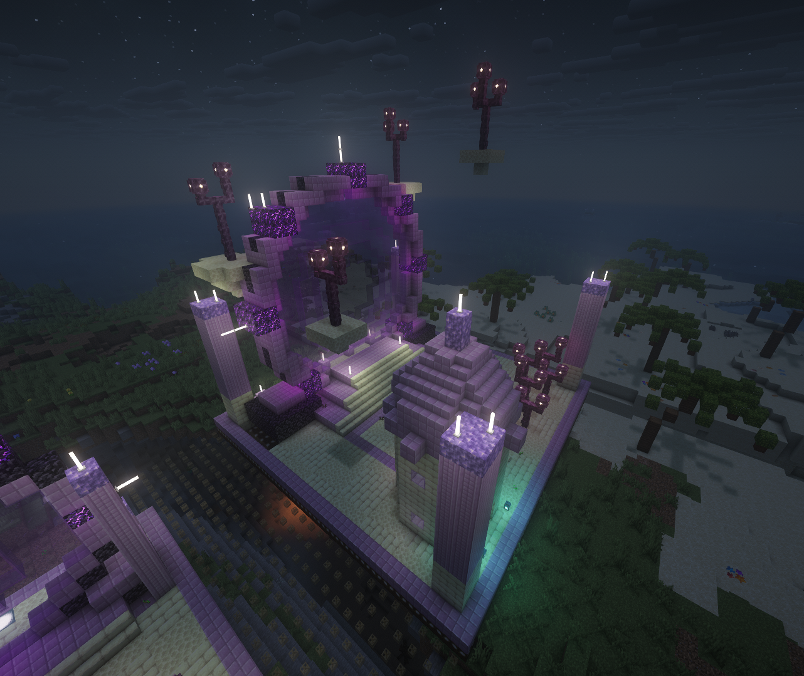
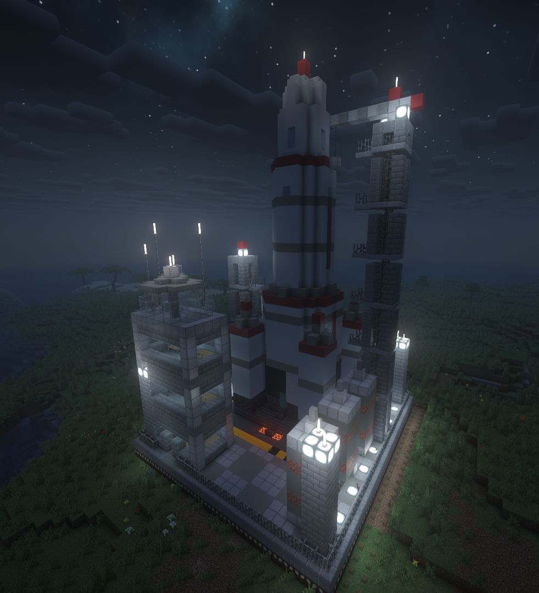
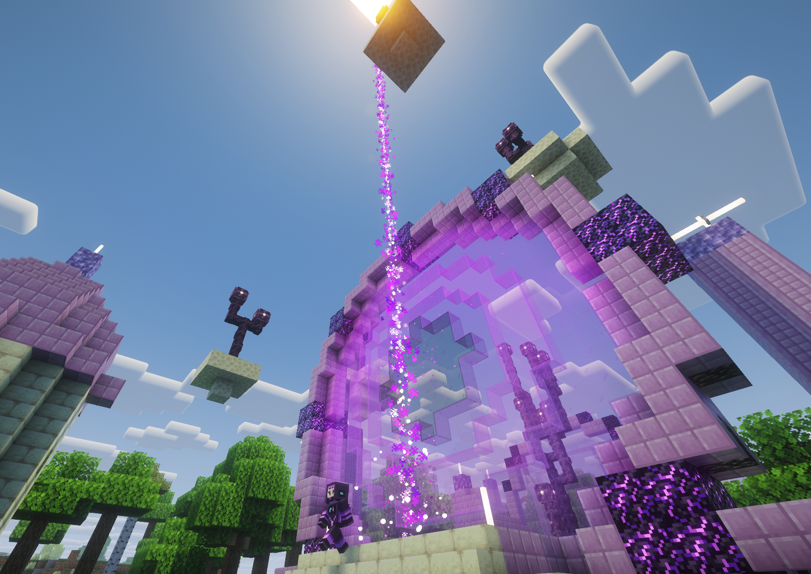
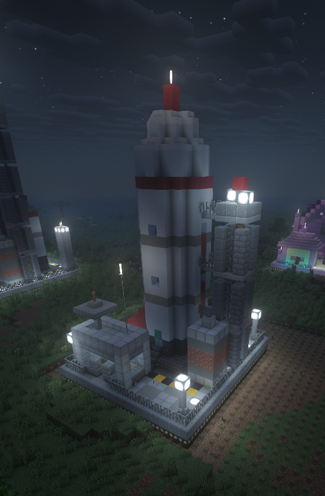

# Voyager - End Expeditions for MineColonies

*A new MineColonies profession that explores the End.*

> **BETA 0.2.0** - the whole expedition loop, both building looks, the research tree and the
> effects have been play-tested in single-player and LAN games. Dedicated servers, the dragon
> encounter and a few research effects have not been exercised yet. Please report bugs with your
> `logs/latest.log` (every expedition is written there with a `[Voyager]` prefix).

Voyager adds one building and one job to [MineColonies](https://www.curseforge.com/minecraft/mc-mods/minecolonies):
the **Departure Point** and the **Voyager** who works there. Every launch window the Voyager packs
rations and supplies, walks to the departure pad, lifts off in a rocket (or is beamed away through
an End Gate) and returns a while later with a haul from the End - end stone, chorus, purpur, ender
pearls, shulker shells, the occasional elytra... if they return at all. Endermen, shulkers and,
for the daring, the dragon are waiting out there.

Made by **Lovkar & Claude** for NeoForge 1.21.1.

|  |  |
| --- | --- |
| *An End Gate at night - the portal glows on its own, shaders or not* | *A level 5 Launchpad: three-stage rocket, crane tower, mission control* |
|  |  |
| *A Voyager leaves through the End Gate - the beam carries them up* | *Level 1 Launchpad: one rocket, one gantry, one control room* |

## Two looks, one building

The bundled *Voyager* structure pack contains both looks of the Departure Point, levels 1-5:

| Look | Style |
| --- | --- |
| **Launchpad** | A rocket on a hazard-striped pad with a control room, gantries and fuel tanks; by level 5 a three-stage rocket with boosters, a crane tower, mission control and a fuel farm |
| **End Gate** | A ring gate of purpur and obsidian with a glowing portal film, chorus trees and an observatory; by level 5 a monumental ring with floating chorus islets |

Pick either in the build tool (they are alternatives of the same "Departure Point" entry). Both
are the same building in every other respect, every level has the same footprint (so upgrades
never grow past the outline you placed) and the pack works next to any colony style.

## How it plays

1. Research **Reach for the Stars** (University → Technology, after *Open the Nether*; needs a
   Nether Mine).
2. Build a Departure Point and hire a Voyager. Adaptability shapes what they find, Agility the
   odds of coming home unhurt.
3. Stock the hut: a sword, a pickaxe, armor, rations (choose them in the Rations tab) and the
   expedition supplies - 64 cobblestone, 4 ender pearls and 16 torches per trip.
4. Wait for a launch window: every three days at level 1-2, every two days at level 3-4, daily at
   level 5.
5. Read the **Expedition Log** in the hut to see what happened out there.

Higher levels bring bigger hauls and rarer finds (purpur and end rods from level 3, obsidian and
dragon's breath from level 4, a small chance of an elytra at level 5), but also more fights.
Every level also lets the Voyager carry better gear: iron tools at level 1, diamond at 2,
netherite at 3, anything (enchantments included) from level 4; armor follows the same ladder as
the guards'. Between fights the Voyager eats rations to recover, so a well-stocked pantry keeps
them alive.

### On a Launchpad

The Voyager climbs into the rocket through its hatch, the engines light and the rocket lifts off -
it is really gone until the expedition returns and lands again (every block of it is stowed by
the building and put back at touchdown). If the crew does not make it home the empty rocket lands
on its own.

### At an End Gate

The ring spins up a vortex, the Voyager vanishes in a flash and a purple beam carries them up
into the sky; before they return the beam comes down again. The portal film glows day and night
(the building keeps invisible light blocks behind the panes - the builder never has to find any)
and breathes End particles while a Voyager works there.

### When things go wrong

Not every Voyager comes home. A Voyager lost in the End gets a grave raised by the Departure
Point's console, so the Undertaker can bury - or resurrect - them like any other colonist.

## Research

**Reach for the Stars** opens its own corner of the Technology tree (all need a Departure Point):

| Research | University | Effect |
|---|---|---|
| Void Insurance / II | 4 / 5 | Voyagers take 25% / 50% less damage in the End |
| Starlight Navigation | 4 | one more expedition per launch window |
| Rapid Refit | 5 | expeditions take 25% less time |
| Buddy System | 5 | a second Voyager per Departure Point (a Launchpad's crews take turns with the rocket) |
| Ender Harvest | 4 | every enderman beaten leaves an extra ender pearl |
| Shulker Whisperer | 4 | every shulker beaten leaves an extra shell |
| Dragon Hunt | 5 | level 5 Voyagers may run into the dragon (1 in 10 trips) - a dragon head and dragon's breath for the survivors |
| Long-range Comms | 4 | the Voyager reports to the colony chat while away |
| Return to Sender | 5 | a lost Voyager's gear comes back to the hut |

## Requirements

- Minecraft 1.21.1, NeoForge 21.1.x
- MineColonies 1.1.1300+ (tested with 1.1.1368) and Structurize

Optional: with [Colonist Errands](https://www.curseforge.com/minecraft/mc-mods/colonist-errands)
2.1.0+ and Talking Colonists, Voyagers can tell you about their last expedition and chat with
their crewmate while they wait for the next launch window.

## Installation

Drop `voyager-<version>.jar` into your `mods` folder next to MineColonies and Structurize. The
structure pack is inside the jar; nothing else to install. Adding the mod to an existing world is
fine - the research appears in the University and the Departure Point in the build tool.

## Building from source

See [BUILDING.md](BUILDING.md). Design notes and the roadmap live in [docs/IDEAS.md](docs/IDEAS.md),
the version history in [docs/CHANGELOG.md](docs/CHANGELOG.md).

## License

GPL-3.0-or-later. The Voyager structure pack (`resources/blueprints/voyager/`), the suit textures
and the sounds are part of the mod and share its license.
